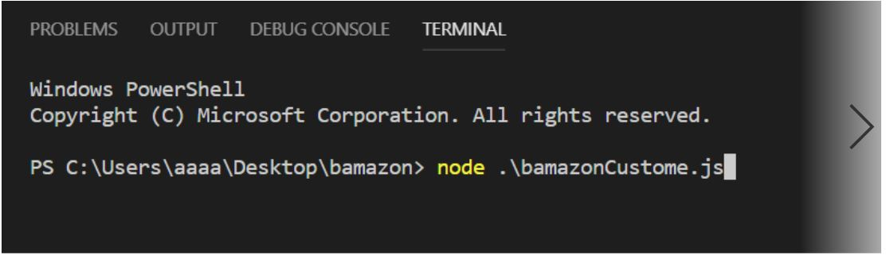
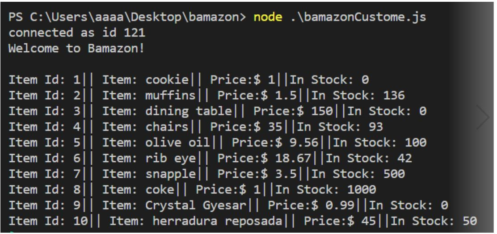
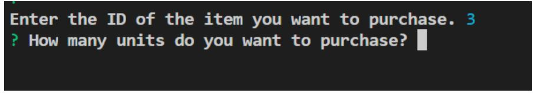
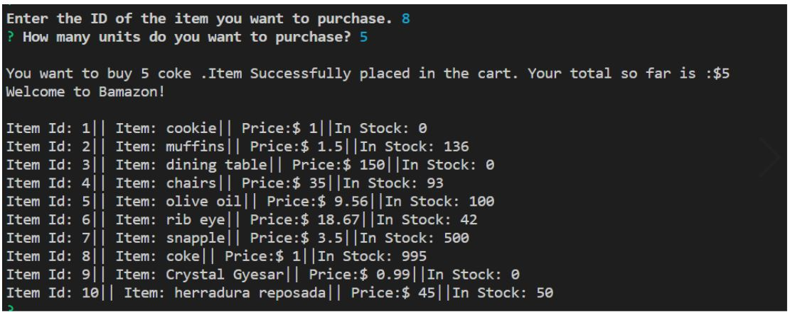
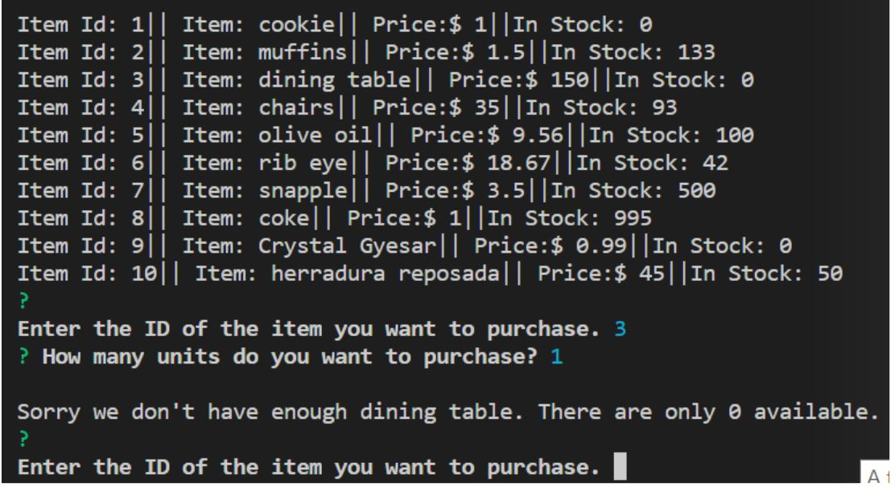

# bamazon
It's not amazon ! it's bamazon

## About

This is an Amazon-like storefront node-app that utilizes a MySQL database to create an inventory. At present, the app is only able to take customers' order and update the inventory as needed. It also keeps track of customers' total due amount.

## Prerequisites

Users of app need to have node installed as well as access to a MySQL database. A MySQL document is provided as a reference. It is necessary to install the required node packages which are saved in the dependencies. 

## Example

Working example of the app.

To start the app one has to open the terminal and run the .js file in node.

When the app is initialized the menu is displayed along with a welcome message.

At the same time user is prompted, first, to enter the id of the item one wants to buy and ,then, enter the amount/numnber of the item.

Then the user inputs the ID of the desired item and then the quantity of the desired item. Then, if the desired amount is available, the user is displayed with total amount due as well as updated menu as well as initial purchasing prompt.

But, if the desired amount is not present, then a users are shown message saying the item is not available. It also tells the users how many of the desired item is present. Then, the initial purchasing prompt is displayed again.

## license

**MIT** license
